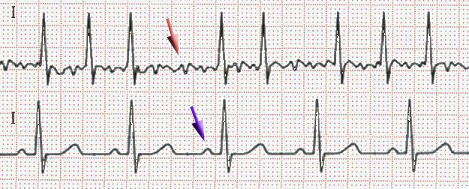
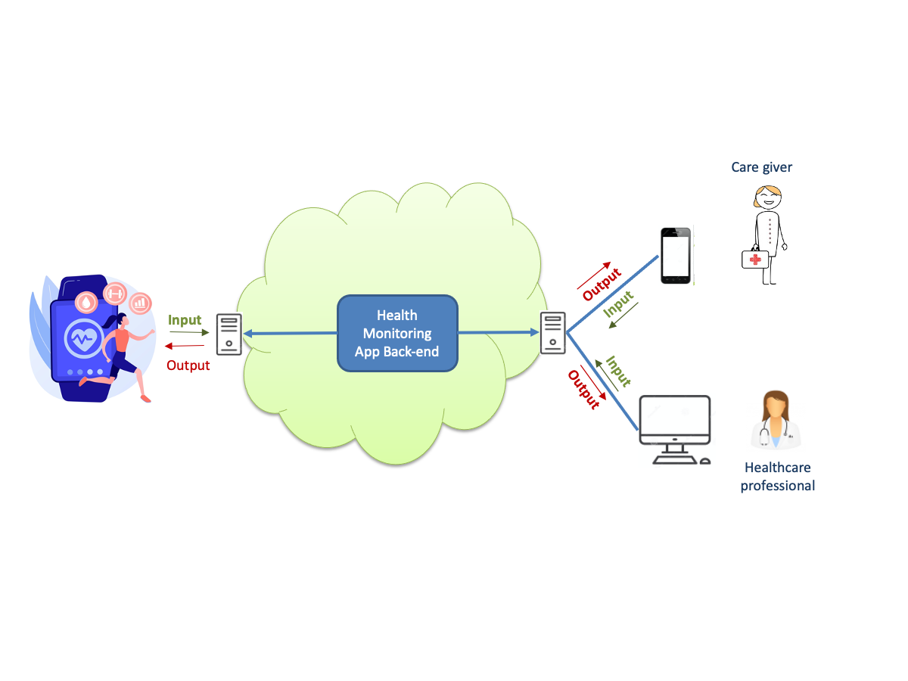
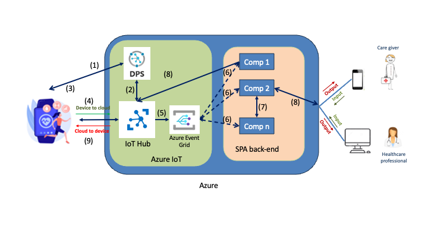

# Heart Monitoring (Smart Process) Application

This section of the repository presents the heart monitoring application.

We introduce the application briefly in the [next section](#overview). The high level architecture is presented in the [High-Level Architecture](#high-level-architecture) section. Section [Heart Monitor](#heart-monitor) gives a brief introduction to the design of the heart monitor. The back-end is explained in [Back End](#back-end).

## Overview

This case study falls into the so-called *connected health* field, which Wikipedia defines as "a socio-technical model for healthcare management and delivery ... to provide healthcare services remotely". *Remote patient monitoring* enables us to combine constant monitoring with minimal healthcare visits. The medical literature reports many instances where remote patient monitoring helped discharge patients from hospitals or other institutional settings, enabling them to receive in-person care at home (see Section 4.1.1 of the book).

Our heart monitoring SPA aims at detecting and monitoring *Atrial Fibrillation*, which is one of the most common forms of irregular heart rhythm (*heart arrhythmia*). It was recommended to us by Dr. Kamel Mili, a cardiologist with over 40 years of experience, for two main *technical* reasons:

  - It can be diagnosed with electro-cardiograms (ECGs), including low-resolutions ones. The following figure shows an ECG exhibiting AFib (*irregularly irregular*, top one) compared to a normal ECG (lower one)
  - Machine learning techniques have been used successfully to predict AFib from ECGs([Christopoulos et al., 2020], [Matias et al., 2021], [Noseworthy et al., 2022], see full references in Chapter 4).
  
  From a *medical* point of view, it is an interesting candidate for constant/remote monitoring because AFib is often asymptomatic, and if left untreated, it can lead to serious complications including stroke and heart failure (see citations in Chapter 4). Finally, in terms of *social impact*, it happens to affect 1 to 2 \% of the general population, increasing to 4 \% over the age of 65, and more than 12 \% for people over 80.
  
## High Level Architecture

The next figure shows a context diagram for our heart remote patient monitoring application.
The heart monitor, per se, is illustrated by a smart watch worn by the patient, which is a plausible scenario as: 1) there are many such smart watches on the market that are able to record two-lead ECGs, and 2) two leads is all we need for classifying/recognizing AFIB.

The Figure also shows that the cloud-hosted heart RPMA back-end can communicate with health care professionals (Doctors, nurses) working in an institutional setting (clinics, hospitals), and with a care giver who can be a live-in relative of the patient, or a home/visiting nurse. *For the purposes of this case study, we will not develop functionalities for healthcare professionals or care givers*.

For the heart monitoring app, we chose to use two commercial products for the IoT and cloud tiers:

- [Azure](https://azure.microsoft.com/)
- [Azure IoT](https://azure.microsoft.com/en-us/solutions/iot)

The resulting architecture is shown in the following Figure (Figure 7.1 from section 7.2.2 of Chapter 7 of the book). 
We use IoT Hub to  ommunicate between the heart monitors and the Azure-hosted heart RPMA back-end. To be able to send telemetry data (ECGs) and receive commands from the back-end via IoT Hub, the heart monitors (devices) need to "register" with IoT Hub (stepp (1)): this is done with Azure IoT's Device Provisiong Service (DPS), which obtains from IoT hub connection endpoints and credentials (step (2)), which it communicates back to the devices (step (3)). From that point on, heart monitors will communicate with IoT hub directly (step (4)) which forwards received events to Azure Event Grid, which implements a publish and subscribe protocol to communicate events of interest to the components of the back-end. Those components include:

 - The component that uses machine learning to classify the most recently uploaded ECG.
 - The component that uses business rules to figure out what to do about the results of the classification. Some of the possible outcomes include taking more frequent, or longer ECGs.
 
The latter requires communicating with the heart monitor to provide it with new recording modalities--frequency and duration of ECG. This "cloud-to-device" communication is illustrated by steps (8) (from back-end to IoT hub) and (9) (from IoT hub to device).
## Heart monitor

We like to think of the "Heart monitor" component of our heart RPMA as consisting of two layers:
 1. The actual "physical device" that is attached to a patient and that knows how to record an ECG of a certain duration in a specified format, when "it is told",
 2. A software layer that "drives" the "physical device", by: a) setting its recording modalities, and b) acting as an intermediary with IoT Hub.

This dichotomy is typical of IoT applications where the term "device" usually refers to a microcontroller (e.g. ESP32) or a mini-computer (e.g. a RASPBERRY PI), to which are connected actual *physical sensors* that capture the data of interest, and that communicates with an IoT framework (Azure IoT in our case).

For the purposes of this case study, we are *simulating* the physical layer (not using real smart watches), but implementing the software layer the way it would be in real life. This is described in more detail in [Architecture of the device layer](heartmonitor/README.md). 
## Back end

