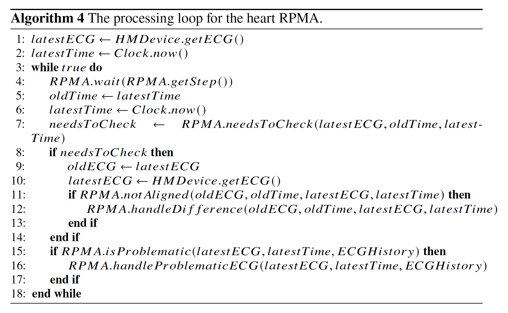

# Heart Monitoring (Smart Process) Application
### Hafedh Mili, Ghizlaine El Boussaidi & Haroun Mili, with input from Prof. Mohamed Bouguessa, and Dr. Kamel Mili, M.D.

This section of the repository presents the back-end of heart monitoring application. To get idea about the full picture, go back to [Introduction to the Heart Patient Monitoring Application](../README.md).

Recall from [Introduction to the Heart Patient Monitoring Application](../README.md) that the application back-end executes the main steps of the heart RPMA processing loop (see below). 

Based on this algorithm, it appears that the back-end is driving. However, like we explained in the introdtcion to the case study ([Introduction](../README.md)), we should have a mixed mode where both the heart monitor and the back-end can initiate action. This entails that the back end would have two processing loops: 1) the processing loop above, amended to add handling of failures in step (10) when the back-end fails to hear from the heart monitor, and 2) an event driven loop that reacts to incoming ECGs, and that "resets the counter". This will be discussed here.

In this documenty, we address:

1. The processing loop, developed jointly by Hafedh and Ghizlaine, described in [Processing loop](#processing-loop).

2. The machine learning component, developed by Haroun, discussed in [ML component](#machine-learning-component).

3. The Business rules component, developed by Hafedh, discussed in [BR component](#business-rule-component).

## Processing loop

## Machine learning component

## Business rule component
